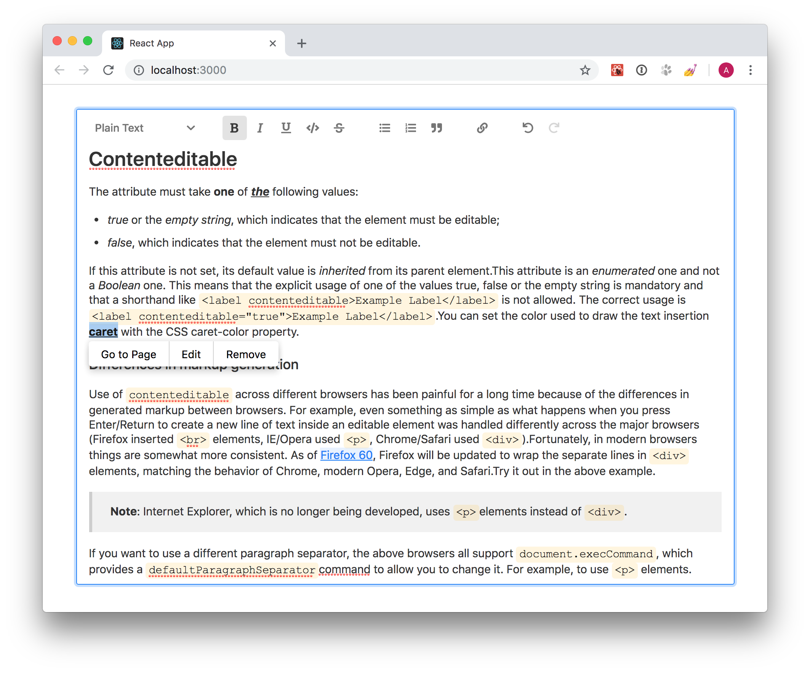

# Draft TextEdit

A rich text editor built using [React](https://github.com/facebook/react) and [Draft.js](https://github.com/facebook/draft-js).



## Demo

[https://draft-textedit.netlify.com/#!/Editor](https://draft-textedit.netlify.com/#!/Editor)

## Installation

Using npm

```shell
$ npm i draft-textedit
```

### Using DraftTextEdit

Import `Editor` component and the styles for it.

```js
import React, { Component } from 'react';
import ReactDOM from 'react-dom';
import Editor from 'draft-textedit';
import 'draft-textedit/dist/DraftTextEdit.css';
import './App.css';

class App extends Component {
  render() {
    return (
      <div className="App">
        <div className="App-editor">
          <Editor placeholder="Write something..." />
        </div>
      </div>
    );
  }
}

ReactDOM.render(<App />, document.getElementById('root'));
```
